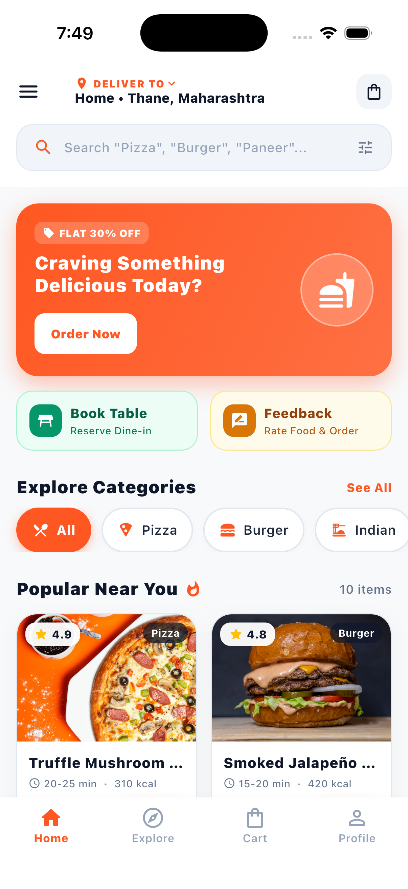
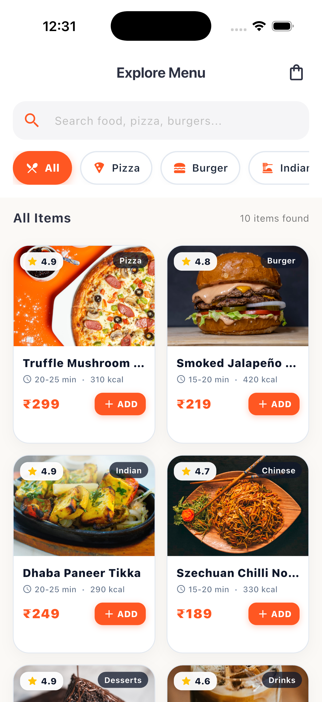
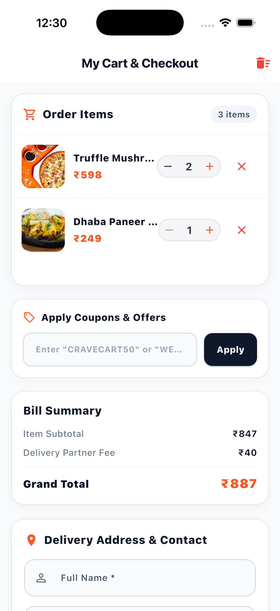
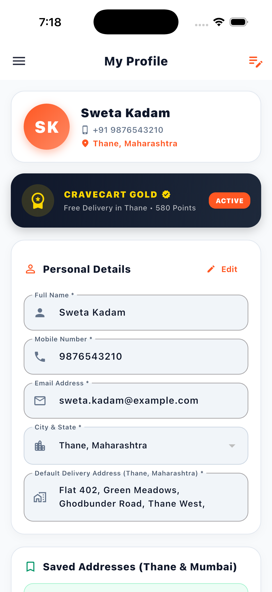

# CraveCart — Food Delivery & Table Booking App

CraveCart is a cross-platform mobile application built using Flutter and Material 3. It provides a complete food ordering and dining experience, allowing users to explore menu items, customize orders, reserve dine-in tables, provide order feedback, and manage their delivery addresses and personal preferences.

---

## App Interface

<table>
  <tr>
    <td align="center" width="25%"><b>Home Dashboard</b></td>
    <td align="center" width="25%"><b>Explore Menu</b></td>
    <td align="center" width="25%"><b>Cart & Checkout</b></td>
    <td align="center" width="25%"><b>User Profile</b></td>
  </tr>
  <tr>
    <td align="center"></td>
    <td align="center"></td>
    <td align="center"></td>
    <td align="center"></td>
  </tr>
</table>

---

## Core Features

### 1. Menu Exploration & Ordering
- Category filters for Pizza, Burgers, Indian, Chinese, Desserts, and Healthy choices.
- Live keyword search across all menu items.
- Item detail views featuring nutritional information, spice indicators, prep time, and price.

### 2. Cart & Order Checkout
- Real-time quantity adjustments, item removal, and instant bill recalculation.
- Promo coupon input field with discount calculations.
- Multiple payment modes including Cash on Delivery (COD), UPI (Google Pay, PhonePe, Paytm), and Credit/Debit cards.

### 3. Localized Delivery
- Default delivery configuration for Thane, Maharashtra.
- Address management supporting multiple saved locations (Home, Work) and 6-digit postal code validation.

### 4. Dine-in Table Reservations
- Booking system with guest count, meal time selection, and date pickers.
- Seating preferences including Rooftop Garden, Indoor AC Bistro, and Private Chef Booth.
- Special instructions field for dietary requirements and event notes.

### 5. Order Rating & Feedback
- Multi-criteria feedback system with star ratings.
- Service attribute tags for taste, delivery speed, and packaging.

### 6. User Profile & Preferences
- Account settings with editable contact details.
- Pure Vegetarian Mode toggle to filter menu items automatically.
- Notification preferences and recent order history.

---

## Technical Stack

- **Framework:** Flutter (Material 3)
- **Language:** Dart
- **State Management:** Flutter ChangeNotifier / CartManager
- **Platform Support:** iOS, Android, Web, macOS, Windows, Linux

---

## Getting Started

### Prerequisites
- Flutter SDK (version 3.27 or higher)
- Android Studio or Xcode (for iOS simulator)

### Setup Instructions

1. Clone the repository:
   ```bash
   git clone https://github.com/Shweta-Tech-creator/cravecart-food-delivery.git
   cd cravecart-food-delivery
   ```

2. Fetch project dependencies:
   ```bash
   flutter pub get
   ```

3. Run the application:
   ```bash
   flutter run
   ```

---

## Testing & Code Quality

Run the test suite and static analysis tools:

```bash
# Execute widget and unit tests
flutter test

# Run static analysis
flutter analyze
```

---

## License
This project is open source and licensed under the MIT License.
